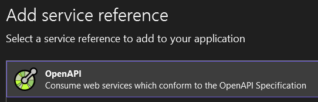

# Using Microsoft.OpenApiReader to create a dynamic client

[microsoft / kiota](https://github.com/microsoft/kiota)

The key here is what is the interesting thing about developing the client?

- Is it exploring the OpenApiReader?
- Is it the process of creating something that works, then something that is neater?
- Is it how easy it is to use OpenAPI, `Microsoft.OpenApi`, `NJsonSchema`, and `RestSharp` to create a dynamic client?
  - I.e., create the best client we can and show how well they fit together.

I think it is the latter. We can point to the first iteration and refer back to [Software in 3 steps: Make it run, make it right, make it fast](https://www.10printiamcool.com/software-in-3-steps-make-it-run-make-it-right-make-it-fast).


Talk about how to invert the OpenApi document to index by `operationId` and not path.

Q: Does an Operation have a method?
A: No, so we need something like...

```csharp
class ClientOperation { // Name?
  public OpenApiOperation Operation { get; }
  public OperationType OperationType { get; }
  public string Path { get; }
  // Request schema?
  // Response schemas by response?
  // IsRequestBodyRequired?
}
```

---

In my [previous post](<[TOO](https://www.10printiamcool.com/validating-json-requests-using-c-and-openapiswagger)>), I discovered the [Microsoft.OpenApi](https://github.com/microsoft/OpenAPI.NET) packages and used them to extract JSON schemas from an Open API document.

At the end of that post, I pondered if it would be possible to build on my experience to create a client that could be used as follows.

```csharp
var petStoreClient =
    await OpenApiClient.CreateAsync(
        File.ReadAllText("petstore.swagger.json"), "https://petstore.swagger.io");

var getPetByIdResponse =
    await petStoreClient.PerformAsync("getPetById", [("petId", "0")]);
```

Now, there are many good options for creating static clients. According to [Claude.ai](TODO), these include:

1. Swagger Codegen

   - An open-source tool that can generate client SDKs in various languages, including C#.

2. OpenAPI Generator

   - A fork of Swagger Codegen with additional features and improvements.

3. NSwag

   - A .NET/TypeScript toolchain for OpenAPI.

4. AutoRest

   - Microsoft's open-source tool for generating client libraries.

5. Kiota

   - Microsoft's latest API client generator, designed to be lightweight and adaptable.

6. SwaggerHub

   - Offers code generation capabilities, including C# clients.

Claude.ai also reminded me that Visual Studio Connected Services is built into Visual Studio, and it can generate C# clients from OpenAPI specifications.

Although I would probably go down the static route for a production system, I was still intrigued by the idea of having a single class that I could configure dynamically configure with just the OpenAPI document. Given this I decided to press on.

## Chapter 1

Following the [Fred Brooks adage](https://en.wikiquote.org/wiki/Fred_Brooks) of 'plan to throw one away; you will, anyhow', I started by creating a rough and ready prototype which can be found [here](https://github.com/andybalham/blog-source-code/blob/master/OpenApiDynamicClient/OpenApiDynamicClient/OpenApiClientV1.cs).

What I noticed when developing this, was that an OpenAPI document is organised around paths and, within those paths, the methods that can be used.

```jsonc
{
  // ...
  "paths": {
    // ...
    "/pet/{petId}": {
      "get": {
        "operationId": "getPetById"
        // ...
      },
      "post": {
        /* ... */
      },
      "delete": {
        /* ... */
      }
    }
  }
}
```

However, my desired API is based around operations and not paths. As a result, the prototype code had to go back up and down the hierarchy to get the details required. This resulted in quite a bit of code like the following.

```csharp
var operationPath =
    _openApiDocument.Paths
        .FirstOrDefault(p =>
            p.Value.Operations.Any(o => o.Value.OperationId == operationId));

var operation =
    operationPath.Value.Operations
        .FirstOrDefault(o => o.Value.OperationId == operationId);
```

So, on the second time through I had the client pre-process the OpenAPI document and build a dictionary of operations.

```csharp
internal record ClientOperation
{
    public OpenApiOperation Operation { get; set; }
    public OperationType OperationType { get; set; }
    public string Path { get; set; }
    public bool RequestBodyRequired { get; set; }
    public JsonSchema RequestBodyJsonSchema { get; set; }
}

private readonly IDictionary<string, ClientOperation> _clientOperations
```

This simplified verifying the operation id and delegating down to perform it.

```csharp
public async Task<JsonResponse> PerformAsync(
    string operationId,
    IEnumerable<(string, string)> parameters)
{
    if (_clientOperations.TryGetValue(operationId, out var clientOperation))
    {
        var jsonResponse =
            await PerformClientOperationAsync(clientOperation, parameters);
        return jsonResponse;
    }

    // <snip>
}
```

## Chapter 2

The original 'perform' method quickly got overly long, weighing in at over 150 lines. However, that did enable me to understand the steps that were required. Pre-armed with this knowledge, my second try was much cleaner.

```csharp
private async Task<JsonResponse> PerformClientOperationAsync(
    ClientOperation clientOperation,
    IEnumerable<(string, string)> parameters)
{
    var restRequest =
        new RestRequest(
            clientOperation.Path, GetMethod(clientOperation.OperationType));

    var parameterErrors = new List<string>();

    SetNonBodyParameters(clientOperation, parameters, restRequest, parameterErrors);

    SetBodyParameter(clientOperation, parameters, restRequest, parameterErrors);

    if (parameterErrors.Count > 0)
    {
        return
            new JsonResponse
            {
                IsSuccessful = false,
                FailureReasons = parameterErrors,
            };
    }

    var restResponse = await _restClient.ExecuteAsync(restRequest);

    var jsonResponse = GetJsonResponse(restResponse);

    return jsonResponse;
}
```

Here we can clearly see how we use the OpenAPI details to prepare the `RestRequest` instance. First to set the path and the method, then to set the parameters as defined by the OpenAPI document. The parameters are validated as they are set, recording any errors in the collection that is then inspected before the request is executed.

The final step is to package the response from `RestSharp` into our own `JsonResponse` class. This keeps the outside code decoupled from the `RestSharp` package.

## RestSharp simplified development

`RestSharp` made the client development straightforward. In particular, the `AddUrlSegment` method allowed me to set the path parameters without having to worry about any string parsing or encoding.

```csharp
private static void AddPathParameter(
    OpenApiParameter openApiParameter,
    IEnumerable<string> parameterValues,
    RestRequest restRequest,
    List<string> parameterErrors)
{
    if (parameterValues.Count() > 1)
    {
        parameterErrors.Add(
            $"{openApiParameter.Name} path parameter has multiple values");
        return;
    }

    restRequest.AddUrlSegment(openApiParameter.Name, parameterValues.First());
}
```

It was a similar situation for the other types of parameters. I could write my code without worrying about encodings.

## OpenApiDocument doesn't contain all properties

One thing that did become apparent during development, was that the `OpenApiDocument` implementation does not contain all possible OpenAPI properties. For example, the `basePath` property is specified in the Petstore example:


However, when inspecting the `OpenApiDocument` instance, it was nowhere to be seen:


As a result, I had to add a `SelectBasePath` method that parsed the OpenAPI document JSON and extracted the value.

```csharp
public static async Task<OpenApiClientV2> CreateAsync(string openApiJson, Uri domainUri)
{
    // <snip>

    var basePath = SelectBasePath(openApiJson); // basePath not in OpenApiDocument
    var baseUri = new Uri(domainUri, basePath);

    return new OpenApiClientV2(clientOperations, baseUri);
}
```

This wasn't a big deal, but is something to be aware of if you are using `OpenApiDocument`. Another example is `collectionFormat`, which specifies how a collection of parameters is packaged.

## Chapter 5

TODO: Compare with statically-generated client


TODO: Do we need the following?




## Compare and contrast

- `ApiException` and `WebException` vs `IsSuccessful`
- Compile-time parameter checking vs runtime checking
- For body validation, `JsonSerializationException` thrown vs schema errors
- 

## Links

- [Generating HTTP API clients using Visual Studio Connected Services](https://devblogs.microsoft.com/dotnet/generating-http-api-clients-using-visual-studio-connected-services/)
