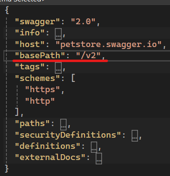
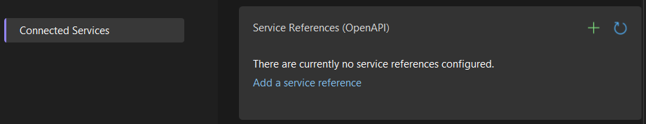
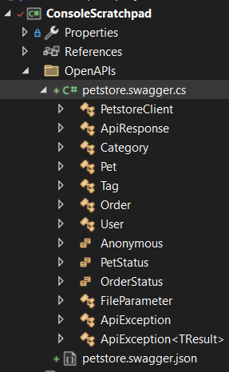

# Using Microsoft.OpenApiReader to create a dynamic client

In my [previous post](<[TOO](https://www.10printiamcool.com/validating-json-requests-using-c-and-openapiswagger)>), I discovered the [Microsoft.OpenApi](https://github.com/microsoft/OpenAPI.NET) packages and used them to extract JSON schemas from an Open API document.

At the end of that post, I pondered if it would be possible to build on my experience to create a client that could be used as follows.

```csharp
var petStoreClient =
    await OpenApiClient.CreateAsync(
        File.ReadAllText("petstore.swagger.json"), "https://petstore.swagger.io");

var getPetByIdResponse =
    await petStoreClient.PerformAsync("getPetById", [("petId", "0")]);
```

Now, there are many good options for creating static clients. According to [Claude.ai](TODO), these include:

1. Swagger Codegen

   - An open-source tool that can generate client SDKs in various languages, including C#.

2. OpenAPI Generator

   - A fork of Swagger Codegen with additional features and improvements.

3. NSwag

   - A .NET/TypeScript toolchain for OpenAPI.

4. AutoRest

   - Microsoft's open-source tool for generating client libraries.

5. Kiota

   - Microsoft's latest API client generator, designed to be lightweight and adaptable.

6. SwaggerHub

   - Offers code generation capabilities, including C# clients.

Claude.ai also reminded me that Visual Studio Connected Services is built into Visual Studio, and it can generate C# clients from OpenAPI specifications.

Although I would probably go down the static route for a production system, I was still intrigued by the idea of having a single class that I could configure dynamically configure with just the OpenAPI document. Given this I decided to press on.

## How did I get on?

In short, I succeeded. The result can be found in GitHub [here](https://github.com/andybalham/blog-source-code/blob/master/OpenApiDynamicClient/OpenApiDynamicClient/OpenApiClientV2.cs).

Example usage can be seen below:

```csharp
var petStoreClient =
    await OpenApiClientV2.CreateAsync(
        File.ReadAllText("petstore.swagger.json"),
        new Uri("https://petstore.swagger.io"));

var getPetByIdResponse =
    await petStoreClient.PerformAsync("getPetById", [("petId", "2")]);

if (getPetByIdResponse.IsSuccessful)
    Console.WriteLine(getPetByIdResponse.Payload);
```

In addition to using [NJsonSchema](TODO) to validate the request bodies, I used the popular [RestSharp](TODO) package to make the HTTP calls. The main routine panned out as follows.

```csharp
private async Task<JsonResponse> PerformClientOperationAsync(
    ClientOperation clientOperation,
    IEnumerable<(string, string)> parameters)
{
    var restRequest =
        new RestRequest(
            clientOperation.Path, GetMethod(clientOperation.OperationType));

    var parameterErrors = new List<string>();

    SetNonBodyParameters(clientOperation, parameters, restRequest, parameterErrors);

    SetBodyParameter(clientOperation, parameters, restRequest, parameterErrors);

    if (parameterErrors.Count > 0)
    {
        return GetJsonResponse(parameterErrors);
    }

    var restResponse = await _restClient.ExecuteAsync(restRequest);

    var jsonResponse = GetJsonResponse(clientOperation, restResponse);

    return jsonResponse;
}
```

By the time this method is called, the OpenAPI document had been pre-processed

The `ClientOperation` class encapsulates the details for a particular operation, as defined in the OpenAPI document. The OpenAPI document is processed as part of the `OpenApiClientV2.CreateAsync` method, and a dictionary of `ClientOperation` instances indexed by operation id is created. This processing allows an efficient use of the operation details to validate the body and non-body parameters. For example, the JSON schemas for request bodies are generated at the point, to be reused as long as the client instance is held.

The `RestSharp` package greatly simplified the client development. In particular, the `AddUrlSegment` method allowed me to set the request parameters without having to worry about any string parsing or encoding.

```csharp
private static void AddPathParameter(
    OpenApiParameter openApiParameter,
    IEnumerable<string> parameterValues,
    RestRequest restRequest,
    List<string> parameterErrors)
{
    if (parameterValues.Count() > 1)
    {
        parameterErrors.Add(
            $"{openApiParameter.Name} path parameter has multiple values");
        return;
    }

    restRequest.AddUrlSegment(openApiParameter.Name, parameterValues.First());
}
```

It was a similar situation for the other types of parameters. I could write my code without worrying about encodings, so keeping it nice and clean.

```csharp
restRequest.AddQueryParameter(openApiParameter.Name, parameterValue);
restRequest.AddHeader(openApiParameter.Name, parameterValues.First());
```

I do confess to only going so far with validating the non-body parameters. My code does check string lengths and apply the supplied regular expression, if available. However, I did not implement numerical limit checks or support for mixed types as mentioned in the [Swagger data types specification](https://swagger.io/docs/specification/data-models/data-types/).

I also left placeholders for extension points. These would allow customisation of the headers supplied for each call. The idea being that this would allow the appropriate authorisation headers to be set for each call.

One thing that did become apparent during development, was that the `OpenApiDocument` implementation does not contain all possible OpenAPI properties. For example, the `basePath` property is specified in the Petstore example:



However, when inspecting the `OpenApiDocument` instance, it was nowhere to be seen:


As a result, I had to add a `SelectBasePath` method that parsed the OpenAPI document JSON and extracted the value.

```csharp
public static async Task<OpenApiClientV2> CreateAsync(string openApiJson, Uri domainUri)
{
    // <snip>

    var basePath = SelectBasePath(openApiJson); // basePath not in OpenApiDocument
    var baseUri = new Uri(domainUri, basePath);

    return new OpenApiClientV2(clientOperations, baseUri);
}
```

This wasn't a big deal, but is something to be aware of if you are using `OpenApiDocument`. Another example is `collectionFormat`, which specifies how a collection of parameters is packaged.

Overall, I was quite pleased with the final result and felt it had quite a bit of promise.

## Comparing with a statically-generated client

I thought it would be interesting to compare my dynamic client with a statically-generated client. To do this, I thought I would use the built in functionality in Visual Studio.

This is done by right-clicking on a project and adding a connected service.


The next step is to select the type of connected service. This will depending on the type of your Visual Studio project. I was working with a .NET Framework project, so I only got the option for OpenAPI.



For .NET Core projects, I believe you get the option of [gRPC](TODO) and perhaps others.

Adding an OpenAPI service is as simple as pointing the wizard to the OpenAPI document and providing the namespace, class name, and language of your choice.


After the wizard runs, we see a single `.cs` file containing multiple classes for the API client, the API models, and other sundries.



The wizard adds a number of NuGet packages, but still doesn't compile. For some reason, it fails to add the `System.ComponentModel.DataAnnotations` package.


Adding this package was all that was required to get the code compiling and ready for use, an example of which is shown below.

```csharp
HttpClient httpClient = new();

PetstoreClient petstoreClient = new(httpClient);

Pet getPetByIdResponse = await petstoreClient.GetPetByIdAsync(2);
```

I am generally a fan of strong-typing, so this usage does appeal to me.

## Comparing and contrasting the two approaches

### Success Flag vs Exceptions

The dynamic client catches all failures and returns an envelope class with a `IsSuccessful` flag. This includes all parameter validation errors, non-success HTTP status codes, and any exceptions. This provides consistency for the calling code, making the code cleaner.

Depending of the failure mode, the static client throws a variety of exceptions. For example, if you supply an invalid request body then you get a `JsonSerializationException` thrown. If the domain is incorrect, you get a `WebException`, and if you get a non-success HTTP status code then an `ApiException` is thrown. There may be others that I did not find. This does mean that the calling code has to be aware of all of these, if it wants to make the most of them when handling them.

I do like consistency, so here I favoured the approach taken by my dynamic client.

### Runtime checking vs compile-time parameter checking

One clear difference between the two approaches is in the type checking. The dynamic client fits the scenario I had, where the calling code was generating JSON. However, in general, I would favour leaning on the compiler to verify types wherever I can. With this in mind, as a user, I would prefer the static client.

### Code ownership

It was interesting to have a look at the generated code. Below is a snippet from one of the implemented operations. As you can see, there is quite a bit of code and this is largely repeated in each method.


I have underlined in green the handling of non-success HTTP status codes, which - as mentioned above - results in `ApiException` instances being thrown.

I have also underlined, this time in red, some of the extension points that are available to you. The client is generated as a [partial class](https://learn.microsoft.com/en-us/dotnet/csharp/programming-guide/classes-and-structs/partial-classes-and-methods). This allows you to create your own partial class to provides your own custom implementations for these methods. This allows the generated client class to be regenerated at any time and also avoids using inheritance to provide the extension points.

What struck me about the generate code, was that there was quite a bit of it, and I would have to own it all if it was part of my project. I am not sure whether I would be overly comfortable with that. On the other hand, the dynamic client has much less code. Once the single class has been tested thoroughly, I would feel happier to use that rather than lots of generated code.

## A hybrid experiment

TODO

I liked the strong typing that you get with the static clients, but I was not too keen on having to own the client code. So I wondered if I could make a hybrid client.

Something could use the automatically-generated models and would have a usage as follows:

```csharp
var client =
    await PetstoreHybridOpenApiClient.CreateAsync(
        new Uri("http://petstore.swagger.io"));

await client.AddPetAsync(new Pet { Name = "Luna" });

Pet pet = await client.GetPetByIdAsync(2999);

ICollection<Pet> pets = await client.FindPetsByStatusAsync([Anonymous.Sold]);
```

As a secondary challenge, I wanted to avoid inheritance and only use composition in my solution. Why? Just for the intellectual challenge and to see what the resulting solution looks and feels like.

## Links

- [Generating HTTP API clients using Visual Studio Connected Services](https://devblogs.microsoft.com/dotnet/generating-http-api-clients-using-visual-studio-connected-services/)

---

[microsoft / kiota](https://github.com/microsoft/kiota)

The key here is what is the interesting thing about developing the client?

- Is it exploring the OpenApiReader?
- Is it the process of creating something that works, then something that is neater?
- Is it how easy it is to use OpenAPI, `Microsoft.OpenApi`, `NJsonSchema`, and `RestSharp` to create a dynamic client?
  - I.e., create the best client we can and show how well they fit together.

I think it is the latter. We can point to the first iteration and refer back to [Software in 3 steps: Make it run, make it right, make it fast](https://www.10printiamcool.com/software-in-3-steps-make-it-run-make-it-right-make-it-fast).


Talk about how to invert the OpenApi document to index by `operationId` and not path.

Q: Does an Operation have a method?
A: No, so we need something like...

```csharp
class ClientOperation { // Name?
  public OpenApiOperation Operation { get; }
  public OperationType OperationType { get; }
  public string Path { get; }
  // Request schema?
  // Response schemas by response?
  // IsRequestBodyRequired?
}
```

## Chapter 1

Following the [Fred Brooks adage](https://en.wikiquote.org/wiki/Fred_Brooks) of 'plan to throw one away; you will, anyhow', I started by creating a rough and ready prototype which can be found [here](https://github.com/andybalham/blog-source-code/blob/master/OpenApiDynamicClient/OpenApiDynamicClient/OpenApiClientV1.cs).

What I noticed when developing this, was that an OpenAPI document is organised around paths and, within those paths, the methods that can be used.

```jsonc
{
  // ...
  "paths": {
    // ...
    "/pet/{petId}": {
      "get": {
        "operationId": "getPetById"
        // ...
      },
      "post": {
        /* ... */
      },
      "delete": {
        /* ... */
      }
    }
  }
}
```

However, my desired API is based around operations and not paths. As a result, the prototype code had to go back up and down the hierarchy to get the details required. This resulted in quite a bit of code like the following.

```csharp
var operationPath =
    _openApiDocument.Paths
        .FirstOrDefault(p =>
            p.Value.Operations.Any(o => o.Value.OperationId == operationId));

var operation =
    operationPath.Value.Operations
        .FirstOrDefault(o => o.Value.OperationId == operationId);
```

So, on the second time through I had the client pre-process the OpenAPI document and build a dictionary of operations.

```csharp
internal record ClientOperation
{
    public OpenApiOperation Operation { get; set; }
    public OperationType OperationType { get; set; }
    public string Path { get; set; }
    public bool RequestBodyRequired { get; set; }
    public JsonSchema RequestBodyJsonSchema { get; set; }
}

private readonly IDictionary<string, ClientOperation> _clientOperations
```

This simplified verifying the operation id and delegating down to perform it.

```csharp
public async Task<JsonResponse> PerformAsync(
    string operationId,
    IEnumerable<(string, string)> parameters)
{
    if (_clientOperations.TryGetValue(operationId, out var clientOperation))
    {
        var jsonResponse =
            await PerformClientOperationAsync(clientOperation, parameters);
        return jsonResponse;
    }

    // <snip>
}
```

## Chapter 2

The original 'perform' method quickly got overly long, weighing in at over 150 lines. However, that did enable me to understand the steps that were required. Pre-armed with this knowledge, my second try was much cleaner.

```csharp
private async Task<JsonResponse> PerformClientOperationAsync(
    ClientOperation clientOperation,
    IEnumerable<(string, string)> parameters)
{
    var restRequest =
        new RestRequest(
            clientOperation.Path, GetMethod(clientOperation.OperationType));

    var parameterErrors = new List<string>();

    SetNonBodyParameters(clientOperation, parameters, restRequest, parameterErrors);

    SetBodyParameter(clientOperation, parameters, restRequest, parameterErrors);

    if (parameterErrors.Count > 0)
    {
        return
            new JsonResponse
            {
                IsSuccessful = false,
                FailureReasons = parameterErrors,
            };
    }

    var restResponse = await _restClient.ExecuteAsync(restRequest);

    var jsonResponse = GetJsonResponse(restResponse);

    return jsonResponse;
}
```

Here we can clearly see how we use the OpenAPI details to prepare the `RestRequest` instance. First to set the path and the method, then to set the parameters as defined by the OpenAPI document. The parameters are validated as they are set, recording any errors in the collection that is then inspected before the request is executed.

The final step is to package the response from `RestSharp` into our own `JsonResponse` class. This keeps the outside code decoupled from the `RestSharp` package.

## RestSharp simplified development

`RestSharp` made the client development straightforward. In particular, the `AddUrlSegment` method allowed me to set the path parameters without having to worry about any string parsing or encoding.

```csharp
private static void AddPathParameter(
    OpenApiParameter openApiParameter,
    IEnumerable<string> parameterValues,
    RestRequest restRequest,
    List<string> parameterErrors)
{
    if (parameterValues.Count() > 1)
    {
        parameterErrors.Add(
            $"{openApiParameter.Name} path parameter has multiple values");
        return;
    }

    restRequest.AddUrlSegment(openApiParameter.Name, parameterValues.First());
}
```

It was a similar situation for the other types of parameters. I could write my code without worrying about encodings.

## OpenApiDocument doesn't contain all properties

One thing that did become apparent during development, was that the `OpenApiDocument` implementation does not contain all possible OpenAPI properties. For example, the `basePath` property is specified in the Petstore example:


However, when inspecting the `OpenApiDocument` instance, it was nowhere to be seen:


As a result, I had to add a `SelectBasePath` method that parsed the OpenAPI document JSON and extracted the value.

```csharp
public static async Task<OpenApiClientV2> CreateAsync(string openApiJson, Uri domainUri)
{
    // <snip>

    var basePath = SelectBasePath(openApiJson); // basePath not in OpenApiDocument
    var baseUri = new Uri(domainUri, basePath);

    return new OpenApiClientV2(clientOperations, baseUri);
}
```

This wasn't a big deal, but is something to be aware of if you are using `OpenApiDocument`. Another example is `collectionFormat`, which specifies how a collection of parameters is packaged.
