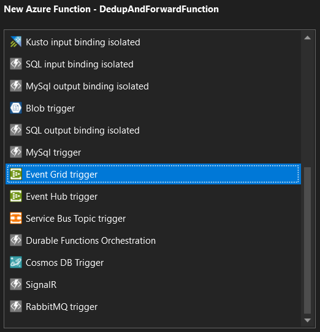
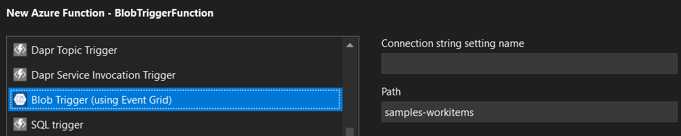

# Reacting to Blob Storage events

- [Reacting to Blob Storage events](#reacting-to-blob-storage-events)
  - [Handling failures](#handling-failures)
  - [Oddities](#oddities)
  - [ConfigureFunctionsWebApplication](#configurefunctionswebapplication)
  - [What are we to include in each post?](#what-are-we-to-include-in-each-post)
  - [Dilemma](#dilemma)
  - [Further thoughts](#further-thoughts)
  - [Initial findings](#initial-findings)
  - [cloudevents.io](#cloudeventsio)
  - [Using TryGetSystemEventData()](#using-trygetsystemeventdata)
  - [Links @ 24-11-10](#links--24-11-10)
  - [EventGrid vs BlobTrigger](#eventgrid-vs-blobtrigger)
  - [Comparing EventGrid schema and CloudEvents schema for Blob storage events](#comparing-eventgrid-schema-and-cloudevents-schema-for-blob-storage-events)
    - [EventGrid Schema](#eventgrid-schema)
    - [CloudEvents Schema](#cloudevents-schema)

## Handling failures

Polly with Azure Functions

## Oddities

- JSON serialization

## ConfigureFunctionsWebApplication


> The registration for method 'ConfigureFunctionsWebApplication' is expected for ASP.NET Core Integration.

> System.InvalidOperationException: Synchronous operations are disallowed. Call WriteAsync or set AllowSynchronousIO to true instead.

[.NET 8 Azure Function.ConfigureFunctionsWebApplication() and synchronous operations are disallowed](https://stackoverflow.com/questions/78408121/net-8-azure-function-configurefunctionswebapplication-and-synchronous-operati)

```csharp
 services.AddOptions<KestrelServerOptions>()
  .Configure<IConfiguration>((settings, configuration) =>
    {
        settings.AllowSynchronousIO = true;
        configuration.Bind(settings);
    });
```

---

## What are we to include in each post?





- First post

  - Polling vs EventGrid

    - [Azure Blob storage trigger for Azure Functions](https://learn.microsoft.com/en-us/azure/azure-functions/functions-bindings-storage-blob-trigger?tabs=python-v2%2Cisolated-process%2Cnodejs-v4%2Cextensionv5&pivots=programming-language-csharp)
      - `[BlobTrigger("test-samples-trigger/{name}")] string myTriggerItem`
      - > Tip: There are several ways to execute your function code based on changes to blobs in a storage container. If you choose to use the Blob storage trigger, note that there are two implementations offered: a polling-based one (referenced in this article) and an event-based one. It is recommended that you use the event-based implementation as it has lower latency than the other. Also, the Flex Consumption plan supports only the event-based Blob storage trigger.
    - [Use Azure Event Grid to route Blob storage events to web endpoint (Azure portal)](https://learn.microsoft.com/en-us/azure/event-grid/blob-event-quickstart-portal?tabs=dotnet)
      - `[EventGridTrigger] EventGridEvent eventGridEvent`

  - EventGrid events vs CloudEvents

    - See [Comparing EventGrid schema and CloudEvents schema for Blob storage events](#comparing-eventgrid-schema-and-cloudevents-schema-for-blob-storage-events) section down below

    - [CloudEvents v1.0 schema with Azure Event Grid](https://learn.microsoft.com/en-us/azure/event-grid/cloud-event-schema)

      - > Azure Event Grid natively supports events in the JSON implementation of CloudEvents v1.0 and HTTP protocol binding. CloudEvents is an open specification for describing event data. CloudEvents simplifies interoperability by providing a common event schema for publishing, and consuming cloud based events. This schema allows for uniform tooling, standard ways of routing & handling events, and universal ways of deserializing the outer event schema. With a common schema, you can more easily integrate work across platforms.

      - > The headers values for events delivered in the CloudEvents schema and the Event Grid schema are the same except for `content-type`. For CloudEvents schema, that header value is `"content-type":"application/cloudevents+json; charset=utf-8"`. For Event Grid schema, that header value is `"content-type":"application/json; charset=utf-8"`.

  - Publish a basic function that reacts to the blob storage events logging out the event

  - Local debugging

    - [Debugging Azure Function Event Grid Triggers Locally](https://harrybellamy.com/posts/debugging-azure-function-event-grid-triggers-locally/)

      ```csharp
        // Default URL for triggering event grid function in the local environment.
        // http://localhost:7071/runtime/webhooks/EventGrid?functionName=EventGridFunction
      ```

    - Didn't work until I found:

      - [Unable to debug Event Grid Trigger Azure function locally](https://stackoverflow.com/questions/77543838/unable-to-debug-event-grid-trigger-azure-function-locally)
      - [Azure Event Grid Trigger function is not working locally](https://github.com/Azure/Azure-Functions/issues/2426)

    - See also [Test your Event Grid handler locally](https://learn.microsoft.com/en-us/azure/communication-services/how-tos/event-grid/local-testing-event-grid)

      - > To help with testing, we show you how to use Postman to trigger your Azure Function with a payload that mimics the Event Grid event.

        ```json
        {
          "profiles": {
            "WebhookFunctionApp": {
              "commandName": "Project",
              "commandLineArgs": "--port 7089",
              "launchBrowser": false
            }
          }
        }
        ```

  - What is the point we want to get to in the first post?
    - Post to MockWebhookEndpointFunction with an AcceptedPayload
    - Log out the payload received

- Second post

  - Error handling, e.g. using dead letter queues

- Third post?

  - Deduplication (using CosmosDB?)

- Fourth post?
  - Alert on failed messages?

We have ValidateAndStoreFunction, should we have DedupeAndForwardFunction?

1. Ensure TryGetSystemEventData returns expected payload (permanent failure)
2. Retrieve the message
3. Calculate a hash of the message payload
4. If hash has been seen before
   1. Log that a duplicate has been received and return
5. Resolve and invoke Endpoint(ContractId, TenantId) with payload
6. If failure then what is the best approach?
   - Throw an exception and let EventGrid retry? How many times?
   - Should/Can we differentiate between temporary failures and permanent ones?
     - Resolution failure (permanent)
     - Bad request (permanent)
     - Timeout (temporary)

Q: How do we report permanent failure? Log an exception and have an alert on that? A metric?

From Claude.ai:

Key Differences and When to Use What:

Azure Monitor Alerts:

- Best for infrastructure-level monitoring
- Platform-wide metrics
- Resource utilization
- Service health
- Cost optimization

Application Insights:

- Application-specific monitoring
- User behaviour analytics
- Performance monitoring
- Code-level diagnostics
- Distributed tracing

How do we use the following? What maps to the endpoint?

- TenantId: This is who is receiving the message
- SenderId: This is who is sending the message
- ContractId: This is what the message contains

Endpoint = fn(ContractId, TenantId)

ASSUMPTIONS:

- We have asserted that the sender is who they say they are (Authenticated)
  - API key
  - IP address
- We have asserted that the sender can send a message with the contract to the tenant (Authorisation)
  - Configuration lookup (not implemented)

So at the point of DedupeAndForwardFunction, we expect the message to succeed.

For the purposes of the blog posts, can we just have a single endpoint? Yes.

- Have some canned response to simulate the various scenarios

## Dilemma

- Deprecated polling approach vs. Event Grid push approach
- React directly to events vs. writing to a queue
  - Need to test the failure scenario with dead letter queues and replaying
  - If writing to a queue, then Storage queues vs. Service Bus queues
    - [Storage queues and Service Bus queues - compared and contrasted](https://learn.microsoft.com/en-us/azure/service-bus-messaging/service-bus-azure-and-service-bus-queues-compared-contrasted)
    - [What is Azure Queue Storage?](https://learn.microsoft.com/en-us/azure/storage/queues/storage-queues-introduction)

## Further thoughts

- Should we implement idempotency at the Validate and Store stage?
  - Or should we always store and de-dupe at the forward stage? E.g. using a hash of the message content before we write to the next queue?
  - What should we use for the list of hashes? Cosmos DB?

Could have:

- DedupeAndQueueFunction
- InvokeEndpointFunction (This might want to dedupe as well, but can do it on message id and not hash)

## Initial findings

- How to debug locally?
  - Can you hook into local events? Not that I could see.
  - [Debugging Azure Function Event Grid Triggers Locally](https://harrybellamy.com/posts/debugging-azure-function-event-grid-triggers-locally/)

```csharp
// Default URL for triggering event grid function in the local environment.
// http://localhost:7071/runtime/webhooks/EventGrid?functionName=EventGridFunction
```

- Didn't work until I found:

  - [Unable to debug Event Grid Trigger Azure function locally](https://stackoverflow.com/questions/77543838/unable-to-debug-event-grid-trigger-azure-function-locally)
  - [Azure Event Grid Trigger function is not working locally](https://github.com/Azure/Azure-Functions/issues/2426)

- See also [Test your Event Grid handler locally](https://learn.microsoft.com/en-us/azure/communication-services/how-tos/event-grid/local-testing-event-grid)
  - > To help with testing, we show you how to use Postman to trigger your Azure Function with a payload that mimics the Event Grid event.

```json
{
  "profiles": {
    "WebhookFunctionApp": {
      "commandName": "Project",
      "commandLineArgs": "--port 7089",
      "launchBrowser": false
    }
  }
}
```

- [CloudEvents v1.0 schema with Azure Event Grid](https://learn.microsoft.com/en-us/azure/event-grid/cloud-event-schema)

  - > Azure Event Grid natively supports events in the JSON implementation of CloudEvents v1.0 and HTTP protocol binding. CloudEvents is an open specification for describing event data. CloudEvents simplifies interoperability by providing a common event schema for publishing, and consuming cloud based events. This schema allows for uniform tooling, standard ways of routing & handling events, and universal ways of deserializing the outer event schema. With a common schema, you can more easily integrate work across platforms.

  - > The headers values for events delivered in the CloudEvents schema and the Event Grid schema are the same except for `content-type`. For CloudEvents schema, that header value is `"content-type":"application/cloudevents+json; charset=utf-8"`. For Event Grid schema, that header value is `"content-type":"application/json; charset=utf-8"`.

- No Data content type: (null), Data schema: (null)

```text
[2024-11-10T09:30:13.886Z] Event type: Microsoft.Storage.BlobCreated, Event subject: blobServices/default/containers/{storage-container}/blobs/{new-file}
[2024-11-10T09:30:13.888Z] Data content type: (null), Data schema: (null)
[2024-11-10T09:30:13.890Z] Data: {"api":"PutBlockList","clientRequestId":"4c5dd7fb-2c48-4a27-bb30-5361b5de920a","requestId":"9aeb0fdf-c01e-0131-0922-9eb549000000","eTag":"0x8D76C39E4407333","contentType":"image/png","contentLength":30699,"blobType":"BlockBlob","url":"https://gridtesting.blob.core.windows.net/testcontainer/{new-file}","sequencer":"000000000000000000000000000099240000000000c41c18","storageDiagnostics":{"batchId":"681fe319-3006-00a8-0022-9e7cde000000"}}
```

- ## Q: How do we convert this to a typed event?

[Azure Event Grid trigger for Azure Functions](https://learn.microsoft.com/en-us/azure/azure-functions/functions-bindings-event-grid-trigger?tabs=python-v2%2Cisolated-process%2Cnodejs-v4%2Cextensionv3&pivots=programming-language-csharp)

> When running your C# function in an isolated worker process, you need to define a custom type for event properties. The following example defines a MyEventType class.

```csharp
public class MyEventType
{
    public string Id { get; set; }

    public string Topic { get; set; }

    public string Subject { get; set; }

    public string EventType { get; set; }

    public DateTime EventTime { get; set; }

    public IDictionary<string, object> Data { get; set; }
}
```

So I got:

```csharp
[Function(nameof(EventGridFunction))]
public void Run([EventGridTrigger] MyEventType myEvent)
```

- Q: Where is the schema set for the events set?

- A: [Create the subscription](https://learn.microsoft.com/en-us/azure/azure-functions/event-grid-how-tos?tabs=v2%2Cportal#create-a-subscription)

- 

- [Publish and Consume events with CloudEvents and Azure Event Grid](https://madeofstrings.com/2018/05/06/publish-and-consume-events-with-cloudevents-and-azure-event-grid/)

- [Azure Event Grid client library for .NET - version 4.27.0](https://learn.microsoft.com/en-us/dotnet/api/overview/azure/messaging.eventgrid-readme?view=azure-dotnet#receiving-and-deserializing-events)
  - [Receiving and Deserializing Events](https://learn.microsoft.com/en-us/dotnet/api/overview/azure/messaging.eventgrid-readme?view=azure-dotnet#receiving-and-deserializing-events)
    - > Note: if using Webhooks for event delivery of the Event Grid schema, Event Grid requires you to prove ownership of your Webhook endpoint before it starts delivering events to that endpoint. At the time of event subscription creation, Event Grid sends a subscription validation event to your endpoint, as seen below. Learn more about completing the handshake here: [Webhook event delivery](https://learn.microsoft.com/en-us/azure/event-grid/webhook-event-delivery).

## [cloudevents.io](https://cloudevents.io/)

Q: Do we want to get use CloudEvents at this point in time?

A: Probably not. That could be another post.

## [Using TryGetSystemEventData()](https://learn.microsoft.com/en-us/dotnet/api/overview/azure/messaging.eventgrid-readme?view=azure-dotnet#deserializing-event-data)

> If expecting mostly system events, it may be cleaner to switch on TryGetSystemEventData() and use pattern matching to act on the individual events. If an event is not a system event, the method will return false and the out parameter will be null.
>
> As a caveat, if you are using a custom event type with an EventType value that later gets added as a system event by the service and SDK, the return value of TryGetSystemEventData would change from false to true. This could come up if you are pre-emptively creating your own custom events for events that are already being sent by the service, but have not yet been added to the SDK. In this case, it is better to use the generic ToObjectFromJson<T> method on the Data property so that your code flow doesn't change automatically after upgrading (of course, you may still want to modify your code to consume the newly released system event model as opposed to your custom model).

```csharp
// If the event is a system event, TryGetSystemEventData will return the deserialized system event
if (egEvent.TryGetSystemEventData(out object systemEvent))
{
    switch (systemEvent)
    {
        case SubscriptionValidationEventData subscriptionValidated:
            Console.WriteLine(subscriptionValidated.ValidationCode);
            break;
        case StorageBlobCreatedEventData blobCreated:
            Console.WriteLine(blobCreated.BlobType);
            break;
        // Handle any other system event type
        default:
            Console.WriteLine(egEvent.EventType);
            // we can get the raw Json for the event using Data
            Console.WriteLine(egEvent.Data.ToString());
            break;
    }
}
else
{
    switch (egEvent.EventType)
    {
        case "MyApp.Models.CustomEventType":
            TestPayload deserializedEventData = egEvent.Data.ToObjectFromJson<TestPayload>();
            Console.WriteLine(deserializedEventData.Name);
            break;
        // Handle any other custom event type
        default:
            Console.Write(egEvent.EventType);
            Console.WriteLine(egEvent.Data.ToString());
            break;
    }
}
```

## Links @ 24-11-10

- [Use Azure Event Grid to route Blob storage events to web endpoint (Azure portal)](https://learn.microsoft.com/en-us/azure/event-grid/blob-event-quickstart-portal?tabs=dotnet)
- [Debugging Azure Function Event Grid Triggers Locally](https://harrybellamy.com/posts/debugging-azure-function-event-grid-triggers-locally/)
- [Azure Event Grid bindings for Azure Functions](https://learn.microsoft.com/en-us/azure/azure-functions/functions-bindings-event-grid?tabs=isolated-process%2Cextensionv3&pivots=programming-language-csharp)
- [Azure Event Grid trigger for Azure Functions](https://learn.microsoft.com/en-us/azure/azure-functions/functions-bindings-event-grid-trigger?tabs=python-v2%2Cisolated-process%2Cnodejs-v4%2Cextensionv3&pivots=programming-language-csharp#example)
- [EventGridEvent Class](https://learn.microsoft.com/en-us/dotnet/api/azure.messaging.eventgrid.eventgridevent?view=azure-dotnet)

## EventGrid vs BlobTrigger

Let me break down the key differences between EventGrid triggers and BlobTriggers for Azure Blob Storage, as they serve different purposes:

EventGrid Trigger:

1. Performance & Scalability

- Near real-time event delivery (typically milliseconds)
- Push-based model - events are pushed to subscribers
- No polling overhead
- Better for high-volume scenarios
- Can handle multiple storage accounts efficiently

2. Event Types

- Supports multiple event types (created, deleted, renamed)
- Can filter events at the subscription level

```json
{
  "filters": {
    "includedEventTypes": ["Microsoft.Storage.BlobCreated"],
    "advancedFilters": [
      {
        "operatorType": "StringEndsWith",
        "key": "subject",
        "values": [".jpg", ".png"]
      }
    ]
  }
}
```

3. Multiple Subscribers

- One event can trigger multiple different systems
- Fan-out pattern support
- Example subscribers:
  - Azure Functions
  - Logic Apps
  - Custom WebHooks
  - Event Hubs
  - Service Bus

BlobTrigger:

1. Operation

- Uses storage polling ("storage logs") to detect changes
- Built-in retry mechanism
- Can have higher latency (scan interval)
- More suitable for single-function scenarios

2. Advantages

- Simpler to set up
- Built-in binding support for blob content
- Better for processing blob content directly

```csharp
// BlobTrigger example
public static void ProcessBlob(
    [BlobTrigger("samples-workitems/{name}")] Stream myBlob,
    string name,
    ILogger log)
{
    log.LogInformation($"Blob\n  Name:{name} \n Size: {myBlob.Length} Bytes");
}
```

Choose EventGrid when:

1. You need near real-time processing
2. Multiple systems need to react to the same event
3. Processing high volumes of blobs
4. You want to implement event-driven architectures

```csharp
// EventGrid trigger example
[FunctionName("ProcessBlobEvent")]
public static async Task Run(
    [EventGridTrigger] EventGridEvent eventGridEvent,
    [Blob("{data.url}", FileAccess.Read)] Stream blob,
    ILogger log)
{
    var data = ((JObject)eventGridEvent.Data).ToObject<StorageBlobCreatedEventData>();
    log.LogInformation($"Blob\n  Name:{data.Url} \n Size: {blob.Length} Bytes");
}
```

Choose BlobTrigger when:

1. Simple blob processing is needed
2. You're working with smaller volumes
3. Some latency is acceptable
4. You need direct blob content access
5. Retry handling is important

Cost Considerations:

1. EventGrid

- Pay per event delivered
- More cost-effective for high-volume scenarios

2. BlobTrigger

- Storage transaction costs for polling
- Can be more expensive with multiple functions polling the same container

## Comparing EventGrid schema and CloudEvents schema for Blob storage events

### EventGrid Schema

```json
{
  "dataVersion": "2",
  "metadataVersion": "1",
  "eventType": "Microsoft.Storage.BlobCreated",
  "topic": "/subscriptions/{subscription-id}/resourceGroups/storage/providers/Microsoft.Storage/storageAccounts/my-storage-account",
  "id": "9b87886d-8b7f-4d99-9ab5-de8e12345678",
  "eventTime": "2023-10-01T10:00:00.0000000Z",
  "subject": "/blobServices/default/containers/{container-name}/blobs/new-file.txt",
  "data": {
    "api": "PutBlob",
    "clientRequestId": "6d79eb1b-0e4d-4123-4567-89abcdef1234",
    "requestId": "9b87886d-0e4d-4123-4567-89abcdef1234",
    "eTag": "0x8D76C39E4407333",
    "contentType": "text/plain",
    "contentLength": 524288,
    "blobType": "BlockBlob",
    "url": "https://my-storage-account.blob.core.windows.net/container/new-file.txt",
    "sequencer": "000000000000000000000000000099999999"
  }
}
```

### CloudEvents Schema

```json
{
  "specversion": "1.0",
  "type": "Microsoft.Storage.BlobCreated",
  "source": "/subscriptions/{subscription-id}/resourceGroups/storage/providers/Microsoft.Storage/storageAccounts/my-storage-account",
  "id": "9b87886d-8b7f-4d99-9ab5-de8e12345678",
  "time": "2023-10-01T10:00:00.0000000Z",
  "subject": "/blobServices/default/containers/{container-name}/blobs/new-file.txt",
  "data": {
    "api": "PutBlob",
    "clientRequestId": "6d79eb1b-0e4d-4123-4567-89abcdef1234",
    "requestId": "9b87886d-0e4d-4123-4567-89abcdef1234",
    "eTag": "0x8D76C39E4407333",
    "contentType": "text/plain",
    "contentLength": 524288,
    "blobType": "BlockBlob",
    "url": "https://my-storage-account.blob.core.windows.net/container/new-file.txt",
    "sequencer": "000000000000000000000000000099999999"
  }
}
```

Key Differences:

1. Schema Structure:

- EventGrid: Uses Azure-specific field names (topic, eventType)
- CloudEvents: Uses standardized field names (source, type)

2. Version Handling:

- EventGrid: Has separate dataVersion and metadataVersion fields
- CloudEvents: Uses single specversion field

3. Code Examples:

EventGrid Schema:

```csharp
[FunctionName("EventGridTrigger")]
public static void Run(
    [EventGridTrigger] EventGridEvent eventGridEvent,
    ILogger log)
{
    log.LogInformation($"Event Type: {eventGridEvent.EventType}");
    log.LogInformation($"Blob URL: {eventGridEvent.Data.ToString()}");

    // Access specific fields
    var blobUrl = JObject.Parse(eventGridEvent.Data.ToString())["url"].ToString();
}
```

CloudEvents Schema:

```csharp
[FunctionName("CloudEventsTrigger")]
public static void Run(
    [EventGridTrigger] CloudEvent cloudEvent,
    ILogger log)
{
    log.LogInformation($"Event Type: {cloudEvent.Type}");
    log.LogInformation($"Source: {cloudEvent.Source}");

    // Access specific fields
    var data = cloudEvent.Data.ToObjectFromJson<BlobCreatedEventData>();
    var blobUrl = data.Url;
}
```

4. When to Use Each:

EventGrid Schema:

- Azure-native applications
- When working primarily within Azure ecosystem
- Need backward compatibility with existing Azure solutions

CloudEvents Schema:

- Cross-cloud applications
- Multi-cloud environments
- Following cloud-neutral standards
- Future-proofing applications

5. Configuration:

EventGrid Schema:

```json
{
  "type": "Microsoft.Storage/storageAccounts/blobServices/containers/blobs",
  "properties": {
    "eventDeliverySchema": "EventGridSchema"
  }
}
```

CloudEvents Schema:

```json
{
  "type": "Microsoft.Storage/storageAccounts/blobServices/containers/blobs",
  "properties": {
    "eventDeliverySchema": "CloudEventSchema"
  }
}
```

6. Benefits:

EventGrid Schema:

- Native Azure integration
- Familiar to Azure developers
- Well-documented in Azure context

CloudEvents Schema:

- Industry standard (CNCF)
- Portable across cloud providers
- Better for hybrid cloud scenarios
- More consistent event handling
