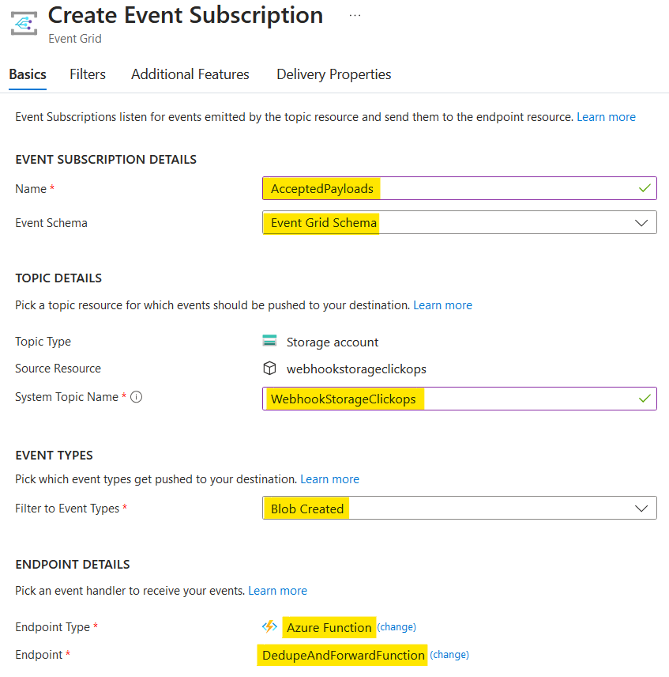
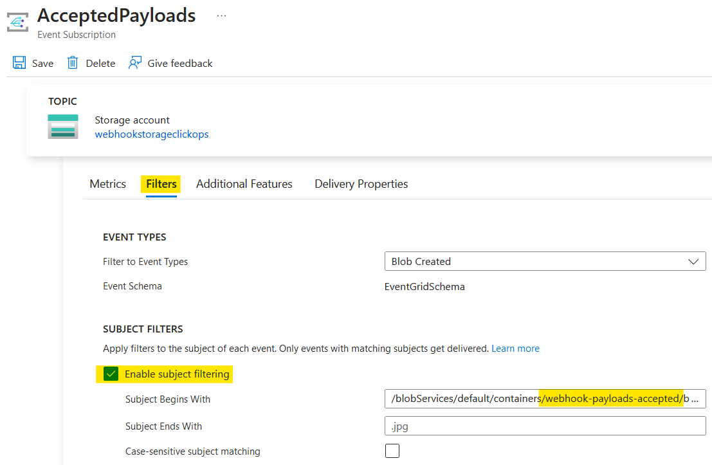

# Reacting to Blob Storage events

- [Reacting to Blob Storage events](#reacting-to-blob-storage-events)
  - [Blob container polling vs. Event Grid events](#blob-container-polling-vs-event-grid-events)
  - [Creating an Event Grid function](#creating-an-event-grid-function)
  - [Cloud Events vs Event Grid Events](#cloud-events-vs-event-grid-events)
  - [Hooking up the function to events](#hooking-up-the-function-to-events)
  - [Adding an event filter](#adding-an-event-filter)
  - [Debugging locally](#debugging-locally)
  - [Processing system events](#processing-system-events)
  - [Summary and next steps](#summary-and-next-steps)

In the previous [post](https://www.10printiamcool.com/connecting-to-cloud-azure-blob-storage) in this [series](https://www.10printiamcool.com/series/azure-serverless) on creating a serverless webhook proxy, I looked at connecting to Azure Blob Storage without connection strings. Now that we have the webhook payloads validated and stored, it is time to look at processing them. So, the first step is reacting to the events raised by Azure Blob Storage.

## Blob container polling vs. Event Grid events

The first choice in our journey is how to react to the payloads being stored. The choice is between a polling-based approach and an event-based approach.

The polling approach is covered in the Microsoft article [Azure Blob storage trigger for Azure Functions](https://learn.microsoft.com/en-us/azure/azure-functions/functions-bindings-storage-blob-trigger?tabs=python-v2%2Cisolated-process%2Cnodejs-v4%2Cextensionv5&pivots=programming-language-csharp).

Below is an abbreviated version of the example given. The code uses the `BlobTrigger` and a path to match on:

```csharp
public static class BlobFunction
{
    [Function(nameof(BlobFunction))]
    public static void Run(
        [BlobTrigger("test-samples-trigger/{name}")] string myTriggerItem)
    {
        // <snip>
    }
}
```

However, I noted the following 'Tip':

> There are several ways to execute your function code based on changes to blobs in a storage container. If you choose to use the Blob storage trigger, note that there are two implementations offered: a polling-based one (referenced in this article) and an event-based one. It is recommended that you use the event-based implementation as it has lower latency than the other.

This tip also included a link to the [Trigger Azure Functions on blob containers using an event subscription](https://learn.microsoft.com/en-us/azure/azure-functions/functions-event-grid-blob-trigger?pivots=programming-language-csharp) Microsoft tutorial.

After reading up on both, I decided to go down the Event Grid route. Using events felt more decoupled than having functions polling the blob container. Plus the lower latency would be an advantage when delivering the webhook payloads.

## Creating an Event Grid function

The next step was to use the Visual Studio wizard to create the Azure function. This function will be triggered on accepted messages and do the following two steps:

1. Deduplicate messages based on the payload
2. Forward messages to the appropriate endpoint

In this post, I won't be covering the first step. We will just look at triggering the function and using the trigger to retrieve the payload and forward it on.

With this functionality in mind, I used the Visual Studio wizard to create a new Azure function called `DedupeAndForwardFunction` and selected the option for 'Event Grid trigger'. The resulting code is shown below.

```csharp
public class DedupeAndForwardFunction
{
    private readonly ILogger<DedupeAndForwardFunction> _logger;

    public DedupeAndForwardFunction(ILogger<DedupeAndForwardFunction> logger)
    {
        _logger = logger;
    }

    [Function(nameof(DedupeAndForwardFunction))]
    public void Run([EventGridTrigger] CloudEvent cloudEvent) // <-- CloudEvent?
    {
        _logger.LogInformation(
            "Event type: {type}, Event subject: {subject}",
            cloudEvent.Type, cloudEvent.Subject);
    }
}
```

What caught my eye was the type of event parameter. What is a `CloudEvent`?

## Cloud Events vs Event Grid Events

A bit of searching led me to the [CloudEvents v1.0 schema with Azure Event Grid](https://learn.microsoft.com/en-us/azure/event-grid/cloud-event-schema) Microsoft article that states:

> Azure Event Grid natively supports events in the JSON implementation of CloudEvents v1.0 and HTTP protocol binding. CloudEvents is an open specification for describing event data. CloudEvents simplifies interoperability by providing a common event schema for publishing, and consuming cloud based events. This schema allows for uniform tooling, standard ways of routing & handling events, and universal ways of deserializing the outer event schema. With a common schema, you can more easily integrate work across platforms.

Looking a bit deeper, the key differences appear to be:

1. Schema Structure:
   - Event Grid: Uses Azure-specific field names (`topic`, `eventType`)
   - Cloud Events: Uses standardised field names (`source`, `type`)
2. Version Handling:
   - Event Grid: Has separate `dataVersion` and `metadataVersion` fields
   - Cloud Events: Uses single `specversion` field

Although Visual Studio pushed me down the `CloudEvent` route, I decided to revert to using `EventGridEvent`. This was because I would be working within the Azure ecosystem and the examples and documentation also favour the use of `EventGridEvent`.

So, the function code became the following, with an extra statement added to output the event as JSON.

```csharp
[Function(nameof(DedupeAndForwardFunction))]
public void Run([EventGridTrigger] EventGridEvent eventGridEvent)
{
    _logger.LogInformation(
        "Event type: {eventType}, Event subject: {subject}",
        eventGridEvent.EventType, eventGridEvent.Subject); // <-- EventType

    _logger.LogDebug(
        "EVENT: {event}",
        JsonSerializer.Serialize(eventGridEvent));
}
```

For more information on Cloud Events, see [cloudevents.io](https://cloudevents.io/).

## Hooking up the function to events

The next step was to get events from Blob Storage triggering the Azure Function. To do this, I navigated to the storage account in the Azure Portal and clicked the 'Event Subscription' button.


I was then prompted to create an event subscription, specifying the name of the subscription and the schema type. It is here that you choose whether the event will be in the Event Grid schema or Cloud Event schema.

I was also prompted for the name to the topic to which the storage account will publish events. It turned out that it looks like a storage account can only publish to one topic, so I chose a name to reflect the storage account. If you create further event subscriptions, then you are not prompted for this again.

Below the topic name, you can select which events are to be published. In my case, I only wanted 'Blob Created' events. Finally, you select the endpoint for the event, which is the `DedupeAndForwardFunction` Azure Function I created and published earlier.



With the event subscription in place, I sent a valid request to the `ValidateAndStoreFunction` Azure Function. The resulting Blob Storage event trigged the `DedupeAndForwardFunction` and the event below was logged.

```json
{
  "id": "0d666914-901e-0082-26b5-3ac1de067d1c",
  "topic": "<snip>",
  "subject": "/blobServices/default/containers/webhook-payloads-accepted/blobs/LovelyLoans/QuickValuationCo/2024-11-19/2024-11-19T18:58:31UTC-be2f0960-ff56-4cab-8465-9ebd0f6b1d5c.json",
  "data": {
    "api": "PutBlob",
    "clientRequestId": "d630505b-bffd-4419-b2a7-f8f109eb275f",
    "requestId": "0d666914-901e-0082-26b5-3ac1de000000",
    "eTag": "0x8DD08CC29D75EE3",
    "contentType": "application/octet-stream",
    "contentLength": 2266,
    "blobType": "BlockBlob",
    "accessTier": "Default",
    "url": "<snip>/webhook-payloads-accepted/LovelyLoans/QuickValuationCo/2024-11-19/2024-11-19T18:58:31UTC-be2f0960-ff56-4cab-8465-9ebd0f6b1d5c.json",
    "sequencer": "0000000000000000000000000003C5ED00000000002bc82a",
    "storageDiagnostics": {
      "batchId": "a7d80882-4006-005a-00b5-3ae687000000"
    }
  },
  "eventType": "Microsoft.Storage.BlobCreated",
  "eventTime": "2024-11-19T18:58:32.4819404Z",
  "dataVersion": ""
}
```

This was all good, but I then sent an invalid request. As I expected, a Blob Storage event trigged the `DedupeAndForwardFunction` Azure Function even though the design requires that only valid requests are forwarded. We can see this by the `webhook-payloads-rejected` in the `subject`.

```json
{
  "id": "b9eb1363-a01e-001f-2bb5-3a3364069d50",
  "topic": "<snip>",
  "subject": "/blobServices/default/containers/webhook-payloads-rejected/blobs/LovelyLoans/QuickValuationCo/2024-11-19/2024-11-19T19:02:58UTC-4ea825da-ac01-4cf4-bcca-86f8d1d36d6d.json",
  "data": {
    "api": "PutBlob",
    "<snip>": "..."
  },
  "eventType": "Microsoft.Storage.BlobCreated",
  "eventTime": "2024-11-19T19:02:58.8654233Z",
  "dataVersion": ""
}
```

One possible solution would be to amend the `DedupeAndForwardFunction` Azure Function to introspect the event and ignore anything not from the `webhook-payloads-accepted` container. However, this would have cost each time it ran. A better way is to add an event filter.

## Adding an event filter

I went back into the Azure Portal and edited the subscription. Selecting the 'Filters' tab, I enabled subject filtering and added a prefix to match on `/blobServices/default/containers/webhook-payloads-accepted/blobs`. This is where having an example event from Azure proved very useful.



With the subscription updated, I ran my tests. First checking that a valid request triggered the function, then a second test checking that only the first Azure Function was triggered. Sure enough, all I saw in the logs was the following.

```text
2024-11-19T19:12:32Z   [Information]   Executing 'Functions.ValidateAndStoreFunction' (Reason='This function was programmatically called via the host APIs.', Id=ab31e19f-eb17-42f1-891b-ae2bdb80bdab)
2024-11-19T19:12:32Z   [Information]   Executed 'Functions.ValidateAndStoreFunction' (Succeeded, Id=ab31e19f-eb17-42f1-891b-ae2bdb80bdab, Duration=16ms)
```

It would still be worth putting a check in the `DedupeAndForwardFunction` Azure Function. It should protect itself from misconfiguration, but log an error to indicate that there is a misconfiguration.

The Microsoft [Event subscription filter object](https://learn.microsoft.com/en-gb/azure/event-grid/subscription-creation-schema?WT.mc_id=Portal-Microsoft_Azure_EventGrid#filter-object) article covers the various options available for filtering. One thing I did note, was that there is no support for wildcards.

## Debugging locally

Now I had my Azure Function triggering, I could start on the actual functionality. Developing this would be much easier if I could run my code locally. A bit of searching turned up the article [Debugging Azure Function Event Grid Triggers Locally](https://harrybellamy.com/posts/debugging-azure-function-event-grid-triggers-locally/).

However, this did point me in the right direction, but still did not work. This prompted more searching which turned up the following two articles:

- [Unable to debug Event Grid Trigger Azure function locally](https://stackoverflow.com/questions/77543838/unable-to-debug-event-grid-trigger-azure-function-locally)
- [Azure Event Grid Trigger function is not working locally](https://github.com/Azure/Azure-Functions/issues/2426)

What turns out to be the misleading part, is this comment added by Visual Studio to the boilerplate Azure Function code.

```csharp
// Default URL for triggering event grid function in the local environment.
// http://localhost:7071/runtime/webhooks/EventGrid?functionName={functionname}
```

It turns out that the port number is not always `7071`. To find out what it is, you need to look in the `launchSettings.json` file.


Here I could see that, in my case, the port was `7089`.

```json
{
  "profiles": {
    "WebhookFunctionApp": {
      "commandName": "Project",
      "commandLineArgs": "--port 7089",
      "launchBrowser": false
    }
  }
}
```

With this knowledge, I was able to hit `F5` and trigger my Azure Function locally with the following request. Note that the `aeg-event-type: Notification` header is required for this to work.

```text
POST http://localhost:7089/runtime/webhooks/EventGrid?functionName=EventGridFunction
content-type: application/json
aeg-event-type: Notification
```

```json
{
  "id": "0d666914-901e-0082-26b5-3ac1de067d1c",
  "subject": "/blobServices/default/containers/webhook-payloads-accepted/blobs/LovelyLoans/QuickValuationCo/2024-11-19/2024-11-19T18:58:31UTC-be2f0960-ff56-4cab-8465-9ebd0f6b1d5c.json",
  "<snip>": "...",
  "eventType": "Microsoft.Storage.BlobCreated",
  "eventTime": "2024-11-19T19:02:58.8654233Z",
  "dataVersion": ""
}
```

See also, the Microsoft article [Test your Event Grid handler locally](https://learn.microsoft.com/en-us/azure/communication-services/how-tos/event-grid/local-testing-event-grid) for more details local testing.

## Processing system events

The final step for this blog post was to process the events and forward the request on to a downstream endpoint. Guided by [Microsoft Learn](https://learn.microsoft.com/en-us/dotnet/api/overview/azure/messaging.eventgrid-readme?view=azure-dotnet#deserializing-event-data), I was pointed to the `TryGetSystemEventData()` method and the following abbreviated code.

```csharp
foreach (EventGridEvent egEvent in egEvents)
{
    // If the event is a system event, TryGetSystemEventData will return the deserialized system event
    if (egEvent.TryGetSystemEventData(out object systemEvent))
    {
        switch (systemEvent)
        {
            case SubscriptionValidationEventData subscriptionValidated:
                Console.WriteLine(subscriptionValidated.ValidationCode);
                break;
            case StorageBlobCreatedEventData blobCreated:
                Console.WriteLine(blobCreated.BlobType);
                break;
            // Handle any other system event type
            default:
                Console.WriteLine(egEvent.EventType);
                // we can get the raw Json for the event using Data
                Console.WriteLine(egEvent.Data.ToString());
                break;
        }
    }
    else
    {
        // <snip>
    }
}
```

Note here the handling of `SubscriptionValidationEventData`. When Azure Event Grid creates a webhook subscription, it sends a subscription validation event to verify the endpoint. The endpoint needs to respond with a specific validation response to confirm the webhook endpoint. However, it turns out you typically don't need to manually return the validation response for an Azure Function `EventGridTrigger`, as the Azure Functions runtime handles this automatically. We do still have to handle the event.

Now that I knew how to handle the incoming events, I was able to extract the Blob Storage URL from the event, load the payload from Blob Storage, then use the details to resolve to the downstream endpoint and invoke it with the body of the original request.

```csharp
switch (systemEvent)
{
    case SubscriptionValidationEventData subscriptionValidated:
        _logger.LogInformation(
            "subscriptionValidated.ValidationCode: {code}",
            subscriptionValidated.ValidationCode);
        break;

    case StorageBlobCreatedEventData blobCreated:
        _logger.LogDebug(
            "blobCreated.Url: {url}",
            blobCreated.Url);

        var acceptedPayload =
            await _payloadStore.GetAcceptedPayloadAsync(blobCreated.Url);

        var endpointProxy =
            _endpointProxyFactory.GetEndpointProxy(
                acceptedPayload.TenantId, acceptedPayload.ContractId);

        await endpointProxy.InvokeAsync(acceptedPayload.Body);

        break;

    default:
        _logger.LogError(
            "Unhandled event type: {eventType}",
            eventGridEvent.EventType);
        break;
}
```

I was able to take advantage of the work I did in my [Connecting to cloud Azure Blob Storage](https://www.10printiamcool.com/connecting-to-cloud-azure-blob-storage) post, which introduced an abstraction over Blob Storage that decouples the code from whether using local or cloud storage and avoids any connection strings.

This allowed me to test my function locally, by simply amending the URL in the event to point to the local storage.

```json
{
  "<snip>": "...",
  "subject": "/devstoreaccount1/webhook-payloads-accepted/LovelyLoans/QuickValuationCo/2024-04-30/2024-04-30T18:13:03UTC-e2a8e023-079c-4ce5-ac0f-2021264f92fe.json",
  "data": {
    "<snip>": "...",
    "url": "http://127.0.0.1:10000/devstoreaccount1/webhook-payloads-accepted/LovelyLoans/QuickValuationCo/2024-04-30/2024-04-30T18:13:03UTC-e2a8e023-079c-4ce5-ac0f-2021264f92fe.json"
  }
}
```

## Summary and next steps

TODO
